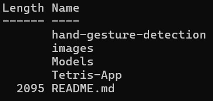
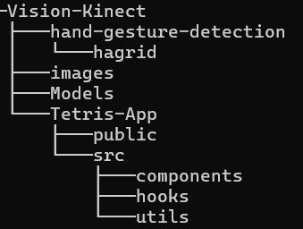
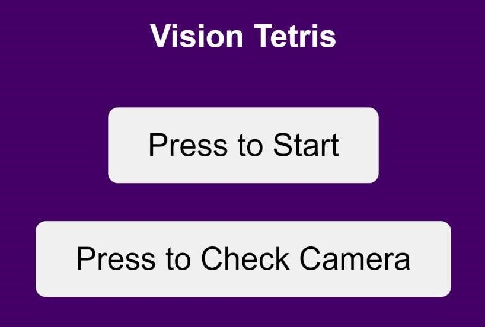
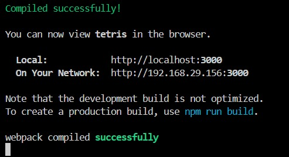

# Instructions

We have provided some instructions and guidelines to follow, in order to setup the tetris app on your local machine.

## Installing from Github

Obviously, the repository is available [here](https://github.com/Vishy70/Vision-Kinect). Click on <button name="button" style="background-color: green; border:0; padding: 5px"> <> Code </button>, and you will find a few options, which are as:

- Open a terminal window, and change into the directory where you want to clone the `Vision Kinect` repository. Then, run the command `git clone https://github.com/Vishy70/Vision-Kinect.git`, or copy the *URL* and run `git clone URL`.
- Use the `Download Zip` option, extract the file to the desired directory.

If you are using terminal, running `ls` will return the following (if you are in the Vision-Kinect directory):

## Overview of the Repository

If installed correctly, the directory structure should look something like this:

## Installations

In order to run `Tetris-App`, a few dependencies are required. These are not any python related dependencies like Open-CV, Pytorch, etc.

- change the terminal to the `Tetris-App` directory.
- Need to install Node.js and npm (a Node package manager). You can look at the Prerequisites section [here](https://radixweb.com/blog/steps-to-build-react-project-with-create-react-app).
- Run `npm install` to get the `node_modules` folder, required for the app. This may take some time.
- You should now be set! Feel free to move onto the next section.

Note: If you are facing issues related to node (related to npm), it could be a version issue. Try running `npm update`, and check if the next section works. If not, try running (*with precaution*) `npm audit fix --force`, and again check if it worked.

## Running the app

Finally, being in the `Tetris-App` directory, run `npm run start` or `npm start`. It should take you to the Tetris-App home screen, in the browser. Else, a *localhost* link should appear in your terminal window.

Front Page

Terminal Window

Congratulations! Hopefully, you the app is now running, and you can get started with playing tetris hands free! Happy Gaming!
